# 
Blogs API

## Dependências

* Hapi/Joi
* EsLint
* Http-Status-Codes
* JSON-Web-Token
* Sequelize
* Express
* MySQL2
* Nodemon

#### Ao iniciar o projeto:

Use o seguinte comando:

~~~
npm install
~~~

# 
Entendendo o projeto

## 
Rotas

&nbsp;

## /user

&nbsp;

## A rota POST '/user' recebe no corpo da requisição os seguintes dados:

&nbsp;

~~~
{
  "displayName": "Brett Wiltshire",
  "email": "brett@email.com",
  "password": "123456",
  "image": "http://4.bp.blogspot.com/_YA50adQ-7vQ/S1gfR_6ufpI/AAAAAAAAAAk/1ErJGgRWZDg/S45/brett.png"
}
~~~

* Verifica a existência dos seguintes campos;
* Verifica se displayName é maior que 8 caracteres;
* Verifica se email tem formato de email;
* Verifica se password tem mais que 6 caracteres;
* Verifica que não é possível cadastrar um usuário existente;

&nbsp;

### Em caso de sucesso, terá um resultado semelhante:

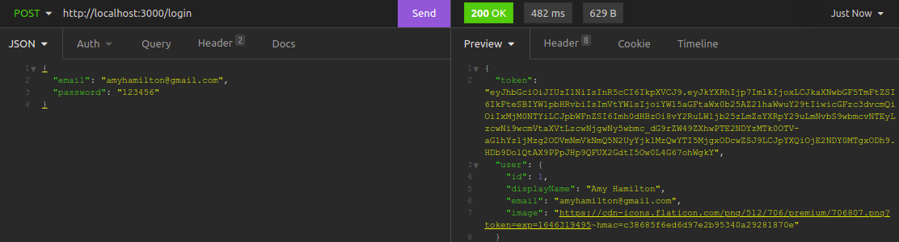

## A rota GET '/post' lista todos os usuários:

&nbsp;

* Verifica se o usuário possui token de validação;
* Verifica se o usuário possui token em um formato válido;

&nbsp;

### Em caso de sucesso, a resposta será:

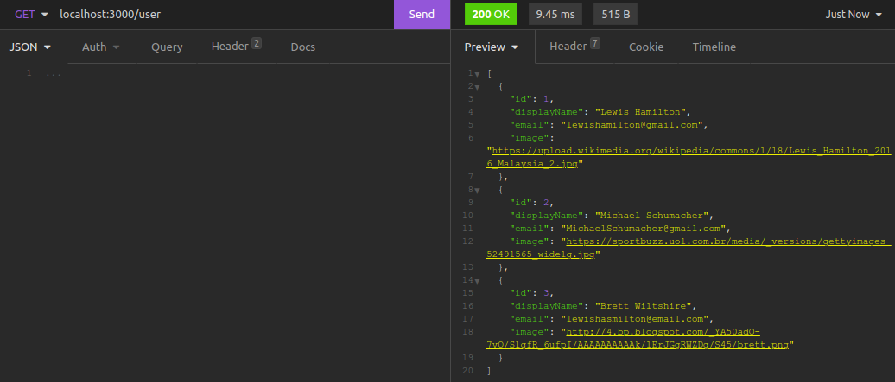

## A rota GET '/user/:id' lista usuário específico:

&nbsp;

* Verifica que não é possível listar usuário inexistente;
* Verifica se o usuário possui token de validação;
* Verifica se o usuário possui token em um formato válido;

&nbsp;

### Em caso de sucesso, a resposta será:

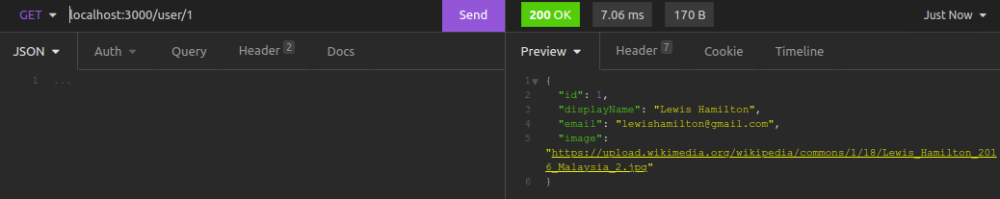

## A rota DELETE '/user/me' deleta o próprio usuário:

&nbsp;

* Verifica se o usuário possui token de validação;
* Verifica se o usuário possui token em um formato válido;

### Em caso de sucesso, a resposta será:

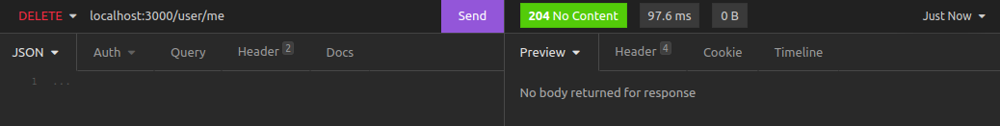

## /login

## A rota POST '/login' recebe os seguintes dados no corpo da requisição e realiza login:

&nbsp;

~~~
{
  "email": "email@mail.com",
  "password": "123456"
}
~~~

&nbsp;

* Verifica que os campos são existentes;
* Verifica que os campos não estão em branco;
* Verifica que não é possível fazer login com usuário que não existe;

### Em caso de sucesso, a resposta será a seguinte:

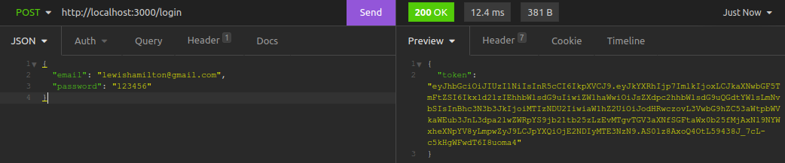

## /categories

## A rota POST '/categories' recebe os seguintes dados no corpo da requisição e cria uma nova categoria:

&nbsp;

~~~
{
  "name": "Inovação"
}
~~~

&nbsp;

* Verifica que o campo name existe;
* Verifica se o usuário possui token de validação;
* Verifica se o usuário possui token em um formato válido;

### Em caso de sucesso, a resposta será a seguinte:

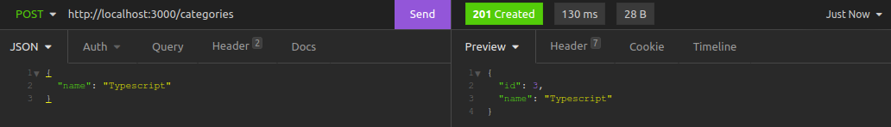

## A rota GET '/categories' lista todas as categorias:

&nbsp;

* Verifica se o usuário possui token de validação;
* Verifica se o usuário possui token em um formato válido;

### Em caso de sucesso, a resposta será a seguinte:

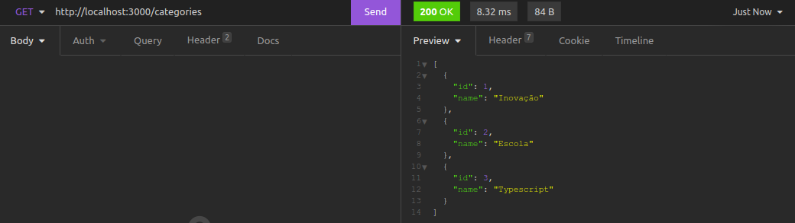

## /post

## A rota POST '/post' recebe os seguintes dados no corpo da requisição e cria uma publicação:

&nbsp;

~~~
{
  "title": "Latest updates, August 1st",
  "content": "The whole text for the blog post goes here in this key",
  "categoryIds": [1, 2]
}
~~~

&nbsp;

* Verifica se os campos não são inexistentes;
* Verifica se categoryIds não está vazio;
* Verifica se o usuário possui token de validação;
* Verifica se o usuário possui token em um formato válido;

### Em caso de sucesso, a resposta será a seguinte:

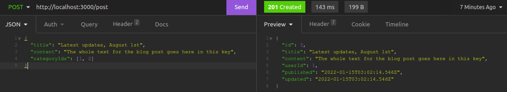

## A rota GET '/post' lista todas as publicações:

&nbsp;

* Verifica se o usuário possui token de validação;
* Verifica se o usuário possui token em um formato válido;

### Em caso de sucesso, a resposta será a seguinte:

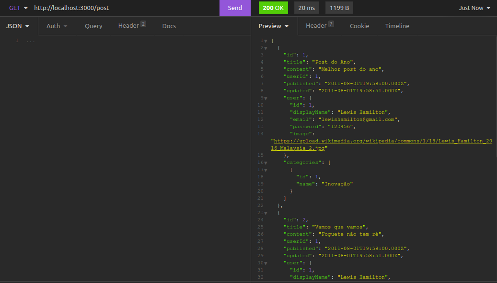

## A rota GET '/post/:id' lista uma publicação específica:

&nbsp;

* Verifica que não é possível listar uma publicação inexistente;
* Verifica se o usuário possui token de validação;
* Verifica se o usuário possui token em um formato válido;

### Em caso de sucesso, a resposta será a seguinte:

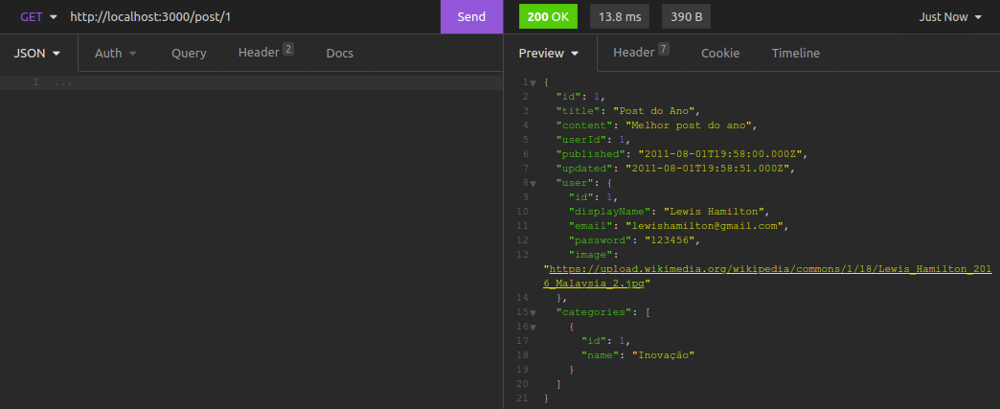

## A rota PUT '/post/:id' atualiza uma publicação e recebe os seguintes dados no corpo da requisição:

&nbsp;

~~~
{
  "title": "Latest updates, August 1st",
  "content": "The whole text for the blog post goes here in this key"
}
~~~

&nbsp;

* Verifica que não é possível editar o ID da publicação;
* Verifica que não é possível editar uma publicação de outro usuário;
* Verifica a existência dos campos;
* Verifica se o usuário possui token de validação;
* Verifica se o usuário possui token em um formato válido;

### Em caso de sucesso, a resposta será a seguinte:

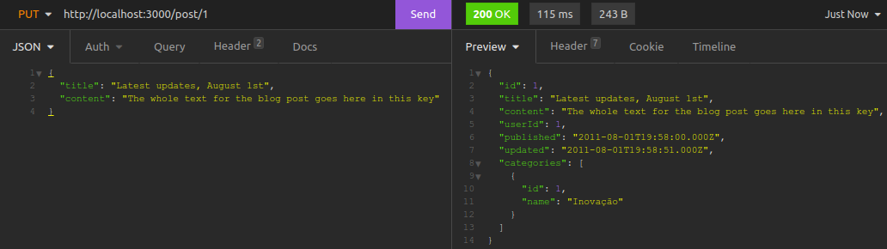

## A rota DELETE /post/:id deleta uma publicação específica:

&nbsp;

* Verifica que não é possível deletar uma publicação de outro usuário;
* Verifica que não é possível deletar uma publicação inexistente;
* Verifica se o usuário possui token de validação;
* Verifica se o usuário possui token em um formato válido;

### Em caso de sucesso, a resposta será a seguinte:

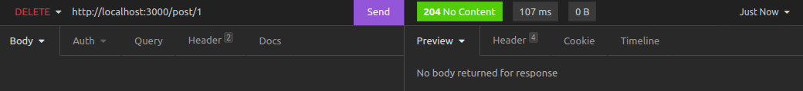

## A rota GET post/search?q=:searchTerm exibe o resultado procurado:

&nbsp;

* Verifica que é possível buscar uma publicação inexistente e retornar um array vazio;
* Verifica que é possível buscar todas as publicações quando a busca está vazia;
* Verifica que é possível buscar uma publicação pelo título;
* Verifica que é possível buscar uma publicação pelo conteúdo;
* Verifica se o usuário possui token de validação;
* Verifica se o usuário possui token em um formato válido;

### Em caso de sucesso, a resposta será a seguinte:

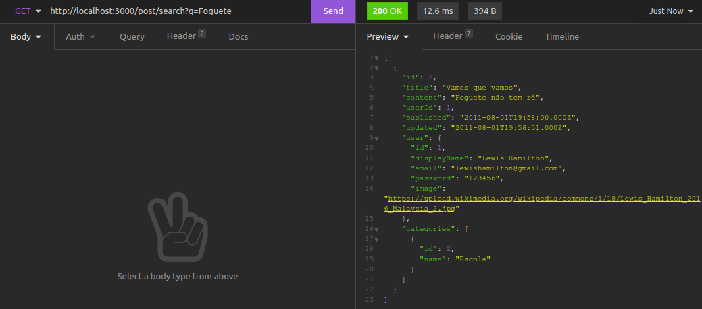

# 
Obrigado!

&nbsp;

# 
Contato

<a href = "mailto:artur.alvaro73@gmail.com">

